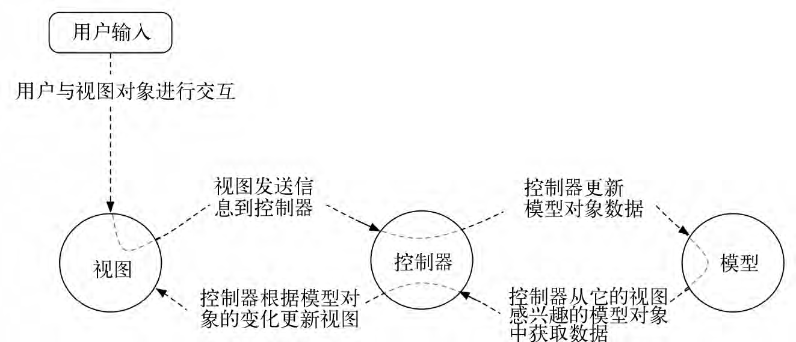

#android项目的框架结构
	> 参考书籍：《Android权威编程指南》，《Android源码设计解析与实战》
	
## 面向对象的六大原则
	1. 单一职责原则
	2. 开闭原则
	3. 里氏替换原则
	4. 依赖倒置原则
	5. 接口隔离原则
	6. 迪米特原则
## 框架模式 MVC与MVP
#### MVC
* MVC简介
	>1. **MVC全称是 Model-View-Controller 也就是模型——视图——控制器**，在1970年的时候由TrygveReenskaug在Smalltalk-80系统首次提出，最开始的时候并不是叫MVC，而是MVCE(E是一个额外的Wditor)，最初的MVC理念和现在的相差不大，其目的都是为了将数据模型和视图分离出来，并以控制器作为连接两者的桥梁以实现解耦。但是，那个时候的MVC的实现与现在的有很大的差别，因为当时计算机只会显示一行行的命令，并没有GUI（图形用户界面：Graphical User Interface，简称 GUI，又称图形用户接口）的概念，因此，那个年代的MVC提出的时候其实是以Model为中心的，当Model发生改变时，View和Controller都会接到Model改变的通知。
	
	>2. **MVC是一种框架模式而非设计模式**，GOF(《Design Patterns: Elements of Reusable Object-Oriented Software》（即后述《设计模式》一书），由 Erich Gamma、Richard Helm、Ralph Johnson 和 John Vlissides 合著（Addison-Wesley，1995）。这几位作者常被称为"四人组（Gang of Four）"。)把**MVC看作是3种设计模式：观察者模式、策略模式和组合模式的合体**。而且其核心在观察者模式，也就是一个基于发布/订阅者模式的框架，很多时候在实际的开发中我们常常还会在MVC框架中使用到其他的设计模式。那么框架模式和设计模式的区别又在何处？比如常见的注解框架，通信框架，数据框架等，在这些框架中常常见到很多设计模式的应用。 **对框架来说，通常是对代码的重用，而对设计来说通常是对设计的重用，简单的理解为框架面向于一系列相同行为代码的重用，而设计则面向的是一系列相同结构代码的重用，我们平常所说的架构则介于框架和设计之间**
	
	> 简而言之：框架是大智慧，用来对软件设计进行分工；设计模式是小技巧，对具体问题提出解决方案，以提高代码复用率，降低耦合度。

* **模型对象 MODEL(data-->InitData)** 
	>存储着应用的数据和业务逻辑。模型类通常被设计用来映射与应用相关的一些事物，如用户、商店里的商品、服务器上的图片或者一段电视节目。模型对象不关心用户界面，它存在的唯一目的就是存储和管理应用数据。Android应用里的模型类通常就是我们创建的定制类。应用的全部模型对象组成了模型层。

* **视图对象 View(\*.xml-->InitView())** 
	> 知道如何在屏幕上绘制自己以及如何响应用户的输入，如用户的触摸等。一个简单的经验法则是，凡是能够在屏幕上看见的对象，就是视图对象。Android默认自带了很多可配置的视图类。当然，也可以定制开发自己的视图类。应用的全部视图对象组成了视图层。

* **控制对象 Controller(Activity-->InitEvent())** 
	>包含了应用的逻辑单元，是视图与模型对象的联系纽带。控制对象被设计用来响应由视图对象触发的各类事件，此外还用来管理模型对象与视图层间的数据流动。在Android的世界里，控制器通常是Activity、Fragment或Service的一个子类。

* MVC数据控制流与用户交互
	
	> 上图展示了在响应用户单击按钮等事件时，对象间的交互控制数据流。注意，模型对象与视图对象不直接交互。控制器作为它们间的联系纽带，接收来自对象的消息，然后向其他对象发送操作指令。

####使用MVC设计模式的优点与缺点
* 优点
	>1. 随着应用功能的持续扩展，应用往往会变得过于复杂而让人难以理解。以Java类的方式组织代码有助于我们从整体视角设计和理解应用。这样，我们就可以按类而不是一个个的变量和方法去思考设计开发问题。**（项目整体--MVC-->类）**
	>* 同样，把Java类以模型、视图和控制层进行分类组织，也有助于我们设计和理解应用。这样，我们就可以按层而非一个个类来考虑设计开发了。**（包类--MVC-->层）**
	>* 使用MVC模式还可以让类的复用更加容易。相比功能多而全的类，有特别功能限定的专用类更加有利于**代码的复用**。
* 缺点
	>1. 由于没有明确的定义，完全理解MVC模式并不是很容易。使用MVC模式需要精心计划，由于内部原理比较复杂，所以需要花费一些时间去思考。另外，由于MVC模式将一个应用分成3个部件，所以，这意味着同一个工程将包含比以前更多的文件。因此，对于一些小规模的项目，MVC反而会带来更大的工作量及复杂性。

#### MVP
* MVP简介
	>1. MVP模式全称 Model-View-Presenter，是MVC的一个演化版本。