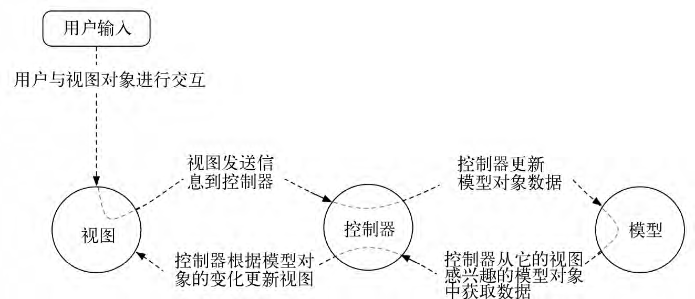

#android APP项目结构

> 参考书籍：
> 
> 《Android权威编程指南》[美] Bill Phillips / [美] Brian Hardy
> 
> [《Android源码设计模式解析与实战》何红辉](http://blog.csdn.net/bboyfeiyu/article/details/50103471)
	
## 面向对象的六大原则
	1. 单一职责原则
	2. 开闭原则
	3. 里氏替换原则
	4. 依赖倒置原则
	5. 接口隔离原则
	6. 迪米特原则
## 框架模式 MVC与MVP
#### MVC
* MVC简介
	>1. **MVC全称是 Model-View-Controller 也就是模型——视图——控制器**，在1970年的时候由TrygveReenskaug在Smalltalk-80系统首次提出，最开始的时候并不是叫MVC，而是MVCE(E是一个额外的Wditor)，最初的MVC理念和现在的相差不大，其目的都是为了将数据模型和视图分离出来，并以控制器作为连接两者的桥梁以实现解耦。但是，那个时候的MVC的实现与现在的有很大的差别，因为当时计算机只会显示一行行的命令，并没有GUI（图形用户界面：Graphical User Interface，简称 GUI，又称图形用户接口）的概念，因此，那个年代的MVC提出的时候其实是以Model为中心的，当Model发生改变时，View和Controller都会接到Model改变的通知。
	
	>2. **MVC是一种框架模式而非设计模式**，GOF(《Design Patterns: Elements of Reusable Object-Oriented Software》（即后述《设计模式》一书），由 Erich Gamma、Richard Helm、Ralph Johnson 和 John Vlissides 合著（Addison-Wesley，1995）。这几位作者常被称为"四人组（Gang of Four）"。)把**MVC看作是3种设计模式：观察者模式、策略模式和组合模式的合体**。而且其核心在观察者模式，也就是一个基于发布/订阅者模式的框架，很多时候在实际的开发中我们常常还会在MVC框架中使用到其他的设计模式。那么框架模式和设计模式的区别又在何处？比如常见的注解框架，通信框架，数据框架等，在这些框架中常常见到很多设计模式的应用。 **对框架来说，通常是对代码的重用，而对设计来说通常是对设计的重用，简单的理解为框架面向于一系列相同行为代码的重用，而设计则面向的是一系列相同结构代码的重用，我们平常所说的架构则介于框架和设计之间**
	
	> 简而言之：框架是大智慧，用来对软件设计进行分工；设计模式是小技巧，对具体问题提出解决方案，以提高代码复用率，降低耦合度。

* **模型对象 MODEL(data-->InitData)** 
	>存储着应用的数据和业务逻辑。模型类通常被设计用来映射与应用相关的一些事物，如用户、商店里的商品、服务器上的图片或者一段电视节目。模型对象不关心用户界面，它存在的唯一目的就是存储和管理应用数据。Android应用里的模型类通常就是我们创建的定制类。应用的全部模型对象组成了模型层。

* **视图对象 View(\*.xml-->InitView())** 
	> 知道如何在屏幕上绘制自己以及如何响应用户的输入，如用户的触摸等。一个简单的经验法则是，凡是能够在屏幕上看见的对象，就是视图对象。Android默认自带了很多可配置的视图类。当然，也可以定制开发自己的视图类。应用的全部视图对象组成了视图层。

* **控制对象 Controller(Activity-->InitEvent())** 
	>包含了应用的逻辑单元，是视图与模型对象的联系纽带。控制对象被设计用来响应由视图对象触发的各类事件，此外还用来管理模型对象与视图层间的数据流动。在Android的世界里，控制器通常是Activity、Fragment或Service的一个子类。

* MVC数据控制流与用户交互
	
	> 上图展示了在响应用户单击按钮等事件时，对象间的交互控制数据流。注意，模型对象与视图对象不直接交互。控制器作为它们间的联系纽带，接收来自对象的消息，然后向其他对象发送操作指令。

####使用MVC设计模式的优点与缺点
* 优点
	>1. 随着应用功能的持续扩展，应用往往会变得过于复杂而让人难以理解。以Java类的方式组织代码有助于我们从整体视角设计和理解应用。这样，我们就可以按类而不是一个个的变量和方法去思考设计开发问题。**（项目整体--MVC-->类）**
	>* 同样，把Java类以模型、视图和控制层进行分类组织，也有助于我们设计和理解应用。这样，我们就可以按层而非一个个类来考虑设计开发了。**（包类--MVC-->层）**
	>* 使用MVC模式还可以让类的复用更加容易。相比功能多而全的类，有特别功能限定的专用类更加有利于**代码的复用**。
	>* 模块职责划分明确。主要划分层M,V,C三个模块，利于代码的维护,可扩展性好,耦合性低。
* 缺点
	>1. 由于没有明确的定义，完全理解MVC模式并不是很容易。使用MVC模式需要精心计划，由于内部原理比较复杂，所以需要花费一些时间去思考。另外，由于MVC模式将一个应用分成3个部件，所以，这意味着同一个工程将包含比以前更多的文件。因此，对于一些小规模的项目，MVC反而会带来更大的工作量及复杂性。

##
#### MVP
* 前话:
	> 可能能你会觉得MVC框架已经很好用了，也能满足任何项目开发，但是，Controller控制器和View视图显示是在一个类Activity中体现出来的，而Android中Activity是担当Controller控制器的角色的，如果界面操作方式繁琐，视图显示复杂，那么我们不得不在Activity中添加更多的View视图显示操作，这样自然增加了Activity的代码量，也导致了Activity承担的任务和逻辑处理太多，职责不清晰。

* MVP简介
	> 1. MVP模式全称 Model-View-Presenter，是MVC的一个演化版本.MVP模式是一个把view从低层模型分离出来的一种现代模式。MVP由model–view–controller (MVC)软件模式衍生而来，常用于构建UI

	> * MVP中的M（model）代表的是将会显示在view（UI）中的数据。
	> * MVP中的V（view）是显示数据（model）并且将用户指令（events）传送到presenter以便作用于那些数据的一个接口。
	
	> * View通常含有Presenter的引用。
	MVP中的P（presenter）扮演的是“中间人”的作用（就如MVC中的controller）
 
* [下图来自本文](http://droidumm.blogspot.com/2011/11/concept-model-view-present-mvp-pattern.html)
* 

* MVP与MVC有着一个重大的区别：在MVP中View并不直接使用Model，它们之间的通信是通过Presenter (MVC中的Controller)来进行的，所有的交互都发生在Presenter内部，而在MVC中View会从直接Model中读取数据而不是通过 Controller。

####MVP优点和缺点:
* 优点
	> 1. 模型与视图完全分离，我们可以修改视图而不影响模型
	> 2. 可以更高效地使用模型，因为所有的交互都发生在一个地方——Presenter内部
	> 3. 我们可以将一个Presenter用于多个视图，而不需要改变Presenter的逻辑。这个特性非常的有用，因为视图的变化总是比模型的变化频繁。
	> 4. 如果我们把逻辑放在Presenter中，那么我们就可以脱离用户接口来测试这些逻辑（单元测试）[1] 
* 缺点
	> 由于对视图的渲染放在了Presenter中，所以视图和Presenter的交互会过于频繁。还有一点需要明白，如果Presenter过多地渲染了视图，往往会使得它与特定的视图的联系过于紧密。一旦视图需要变更，那么Presenter也需要变更了。比如说，原本用来呈现Html的Presenter现在也需要用于呈现Pdf了，那么视图很有可能也需要变更。

######参考资料:

* [ "张鸿洋csnd博客MVP"](http://blog.csdn.net/lmj623565791/article/details/46596109)
* [ "废墟的树csnd博客MVC"](http://blog.csdn.net/feiduclear_up/article/details/46363207)
* [ "废墟的树csnd博客MVP"](http://blog.csdn.net/feiduclear_up/article/details/46374653)
* [何红辉Github,一种在android中实现MVP模式的新思路](https://github.com/hehonghui/android-tech-frontier/tree/master/androidweekly/%E4%B8%80%E7%A7%8D%E5%9C%A8android%E4%B8%AD%E5%AE%9E%E7%8E%B0MVP%E6%A8%A1%E5%BC%8F%E7%9A%84%E6%96%B0%E6%80%9D%E8%B7%AF)
* [何红辉Github,Android上MVP的介绍](https://github.com/hehonghui/android-tech-frontier/blob/master/issue-12/Android%E4%B8%8AMVP%E7%9A%84%E4%BB%8B%E7%BB%8D.md)
