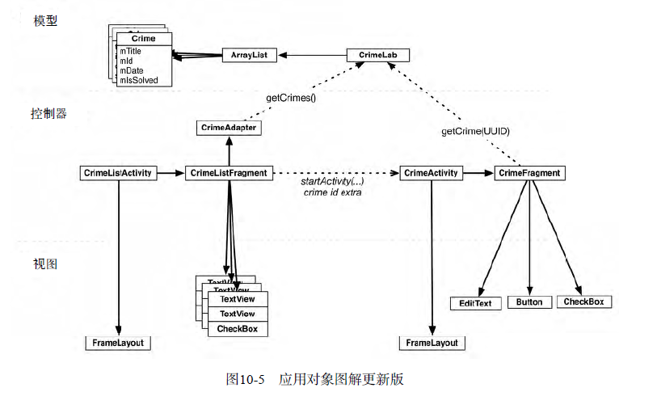
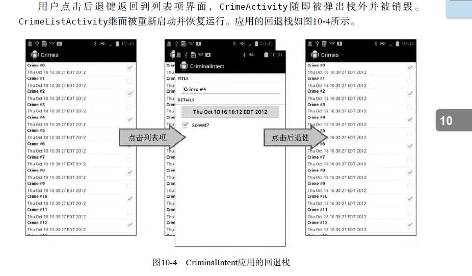
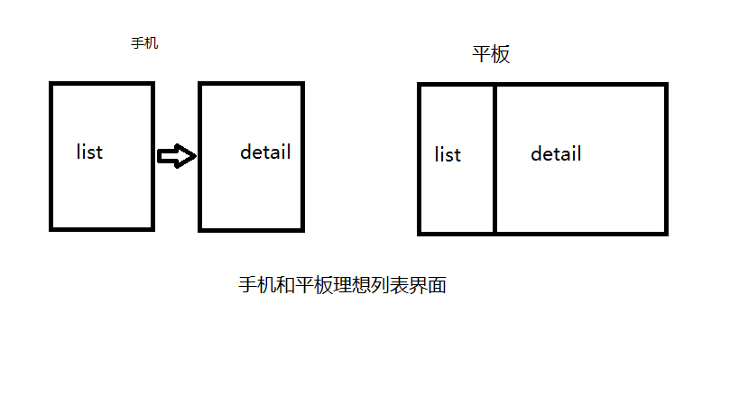
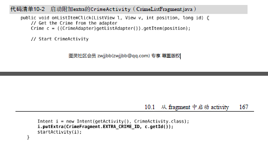
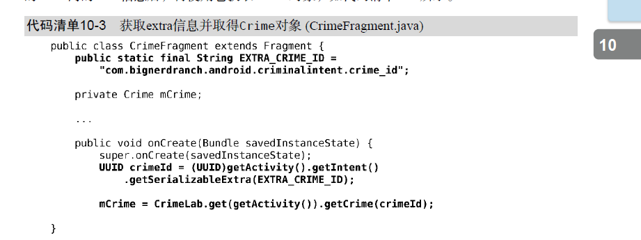
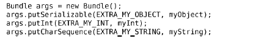
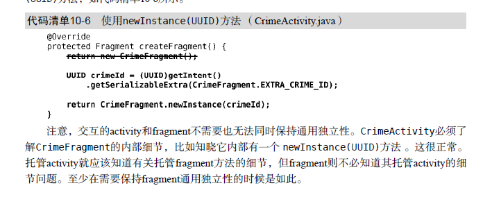
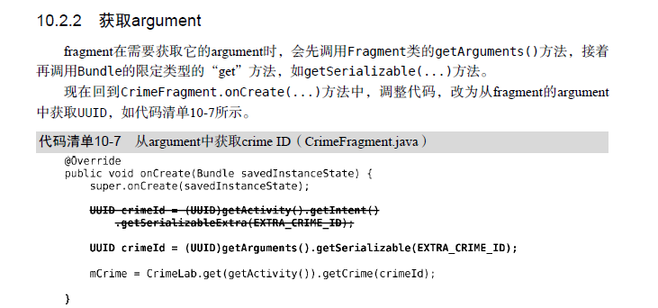

##UI fragment与fragment管理器



####1. UI设计的灵活性需求

####2. fragment的引入
* 采用fragment而不是activity进行应用的UI管理，可绕开Android系统对activity的限制。

* 为托管UI fragment，activity必须做到：
	>1. 在布局中为fragment的视图安排位置
	>2. 管理fragment的生命周期

* 托管的两种方式：
	>1. 添加fragment到activity布局中；
		* 优点：简单；缺点：灵活性不够
		* 添加fragment到activity布局中，就等同于将fragment及其视图绑定在一起，且在activity的生命周期过程中，无法切换fragment。
	>2. 在activity代码中添加fragment；
		* 比较复杂的方式，但也是唯一一种可以在运行时控制fragment的方式。我们可以决定何时将fragment添加到activity中以及随后可以完成何种具体任务；也可以移除fragment，用其他的fragment替换。

* 在activity中定义容器视图
	
* 在fragment中创建UI fragment
	
* 添加fragment到fragmentmanager
```
	FragmentManager fm = getSupportFragmentManager();
        Fragment fragment = fm.findFragmentById(R.id.fragmentContainer);
        if (fragment == null) {
            fragment = new CrimeFragment();
            fm.beginTransaction()
                    .add(R.id.fragmentContainer, fragment)
                    .commit();
        }
```
	
####3. fragmentactivity的封装
	```java
	public abstract class SingleFragmentActivity extends AppCompatActivity {
	    protected abstract  Fragment createFragment();
	    @Override
	    protected void onCreate(Bundle savedInstanceState) {
	        super.onCreate(savedInstanceState);
	        setContentView(R.layout.activity_fragment);
	
	        FragmentManager fm = getSupportFragmentManager();
	        Fragment fragment = fm.findFragmentById(R.id.fragmentContainer);
	
	        if (fragment == null) {
	            fragment = createFragment();
	            fm.beginTransaction()
	                    .add(R.id.fragmentContainer, fragment)
	                    .commit();
	
	        }
	    }
	}
	```
##更新CrimeIntent 模型
#### 1.单例与数据集中存储
	在CriminalIntent应用中，crime数组对象将存储在一个单例里。单例是特殊的java类，在创建实例时，一个类仅允许创建一个实例。
	
	应用能够在内存里存在多久，单例就能存在多久，因此将对象列表保存在单例里可保持crime数据的一直存在，不管activity、fragment及它们的生命周期发生什么变化。
	
	要创建单例，需创建一个带有私有构造方法及get()方法的类，其中get()方法返回实例。如实例已存在，get()方法则直接返回它；如实例还未存在，get()方法会调用构造方法来创建它。
	
	private static CrimeLab sCrimeLab;
    private Context mAPPContext;
	public static CrimeLab get(Context context) {
        if (sCrimeLab == null) {
            sCrimeLab = new CrimeLab(context.getApplicationContext());
        }
        return sCrimeLab;
    }

#### 2.创建ListFragment

#### 3.ListFragment、ListView和ArrayAdapter使用

#### 4.使用fragment argument
* 从fragmen中启动activity（不推荐）
	>
	

	>直接获取extra信息方式的缺点
	只需几行简单的代码，就可实现让fragment直接获取托管activity的intent。然而，这种方式是
	以牺牲fragment的封装性为代价的。CrimeFragment不再是可复用的构建单元， 因为它总是需要
	由某个具体activity托管着，该activity的Intent又定义了名为EXTRA_CRIME_ID的extra。
	就CrimeFragment类来说，这看起来合情合理。但这也意味着，按照当前的编码实现，
	CrimeFragment便再也无法用于任何其他的activity了。
	一个比较好的做法是，将mCrimeId存储在CrimeFragment的某个地方，而不是将它保存在
	CrimeActivity的私有空间里。这样，无需依赖于CrimeActivity的intent内指定extra的存在，
	CrimeFragment就能获取自己所需的extra数据信息。fragment的“某个地方”实际就是它的
	arguments bundle。


* 使用fragment argument
	
	>每个fragment实例都可附带一个Bundle对象。该bundle包含有key-value对，我们可以如同附
	加extra到Activity的intent中那样使用它们。一个key-value对即一个argument。
	要创建fragment argument，首先需创建Bundle对象。然后，使用Bundle限定类型的“put”
	方法（类似于Intent的方法），将argument添加到bundle中（如以下代码所示）。
	

	1. // 为保持fragment的通用独立性，在frgment中创建newInstance
    ```
	public static CrimeFragment newInstance(UUID crimeId) {
        Bundle bundle = new Bundle();
        bundle.putSerializable(EXTRA_CRIME_ID, crimeId);
        CrimeFragment fragment = new CrimeFragment();
        fragment.setArguments(bundle);
        return fragment;
    }
	```
	
	2. 在activity中使用newInstance
	

	3. 在fragment中获取argument
	

	4. 在ListFragment中重新加载显示列表项
	```
	 @Override
    public void onResume() {
        super.onResume();
        // 由于和CrimeFragment用的是同一个model=>CrimeLab,所以只要重新刷新notifyDataSetChanged()，并不需要重新加载，同理网络请求也可参考这个做法
        ((CrimeAdapter)getListAdapter()).notifyDataSetChanged();
    }
	```